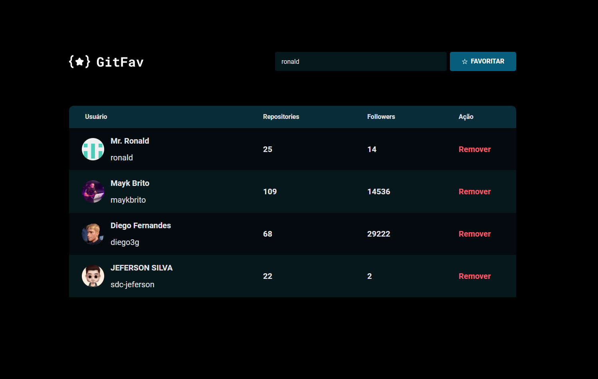

<h1 align="center">Explorer -  Stage06 - GitFav</h1>

&nbsp;&nbsp;&nbsp;

 

---

## 💻 Projeto - GitFav

Desafio 02 realizado durante o programa Explorer da Rocketseat localizado no nível 6, foi construido uma página onde é possível favoritar usuários do GitHub para estudar conceitos de Assincronismo, Promises, POO, Classes, Herança, Polimorfismo, Imutabilidade, Método filter(), localStorage, API, fetch(), Desestruturação no JavaScript, Async functions e Try, catch e throw;

Imagem de GitFav

## 🧪 Tecnologias | HTML ,CSS e JS.
---
- API GitHub
- Assincronismo
- Promises
- POO
- Classes
- Herança
- Polimorfismo
- Imutabilidade
- Método filter()
- localStorage
- API
- fetch()
- Desestruturação no JavaScript
- sync functions
- Try, catch e throw
  
##  📕 Sobre  

Este é um projeto desenvolvido em treinamento, juntamente com a 
<a  href="https://www.rocketseat.com.br">Rocketseat</a> 🚀
no decorrer do programa <b>Explorer</b>.

### Informações  

🕛 **Status:** Concluído✔️

☑️ **Task:** Construir um site estático a partir do projeto feito no [Figma](https://www.figma.com).
- [Design Figma - GitFav](https://www.figma.com/file/QelbQIljHHUPhykZHRUMFB/%5BDesafios-Explorer%5D-GitFav-(Copy)-(Copy)?type=design&node-id=205-951&mode=design&t=pFF3AiUG4jYeW6pD-0)
- [EXPLORER - Rocketseat](https://www.rocketseat.com.br/explorer)

Developed by Jeferson 🚀

